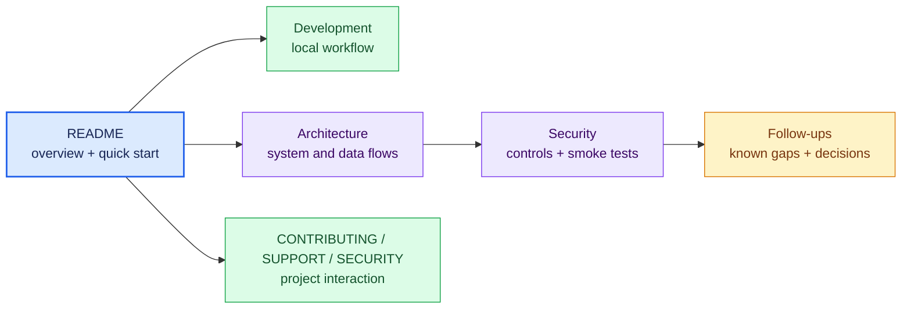

# Documentation index

Julian's documentation is organized by reader need: the README gets the app
running, how-to pages support work, reference pages record exact controls, and
the architecture page explains how the pieces fit together.

| Document | Use it when |
| --- | --- |
| [`../README.md`](../README.md) | You need the product overview, quick start, deployment summary, or main checks |
| [`development.md`](development.md) | You are setting up OAuth locally, running checks, or changing application data flow |
| [`architecture.md`](architecture.md) | You need system context, request/OAuth/data flows, browser storage, deployment, or failure behavior |
| [`security.md`](security.md) | You are changing the Worker boundary, OAuth handling, rate limits, headers, or production verification |
| [`follow-ups.md`](follow-ups.md) | You need current gaps, gotchas, tuning decisions, or explicitly deferred work |
| [`../CONTRIBUTING.md`](../CONTRIBUTING.md) | You are preparing a change |
| [`../SECURITY.md`](../SECURITY.md) | You need to report a vulnerability privately |
| [`../SUPPORT.md`](../SUPPORT.md) | You need usage help or the correct issue path |

When implementation changes, update the narrowest owning page and any diagram
whose boundaries or arrows changed. `follow-ups.md` is the visible backlog for
documentation-worthy gaps; GitHub issues may hold execution detail.
