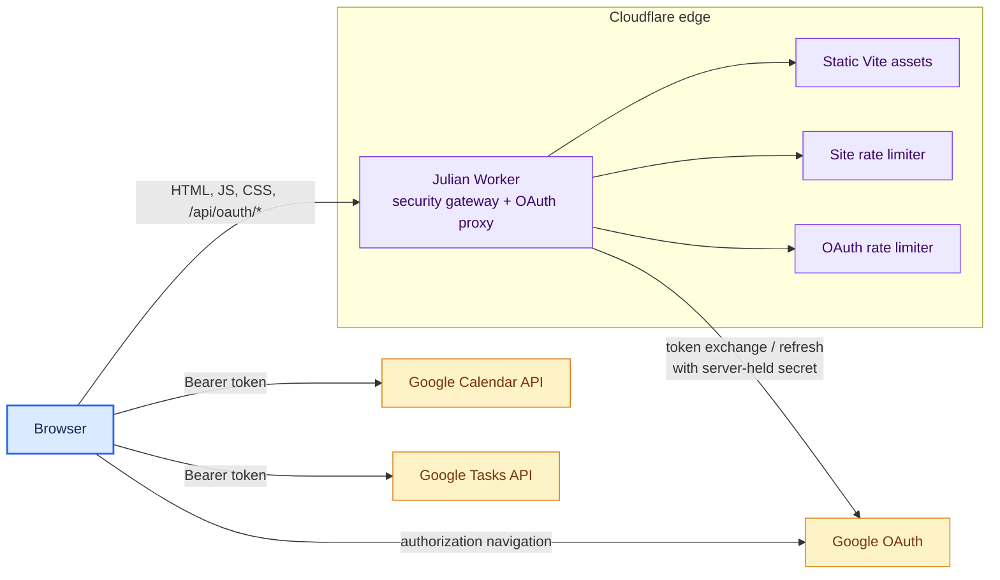
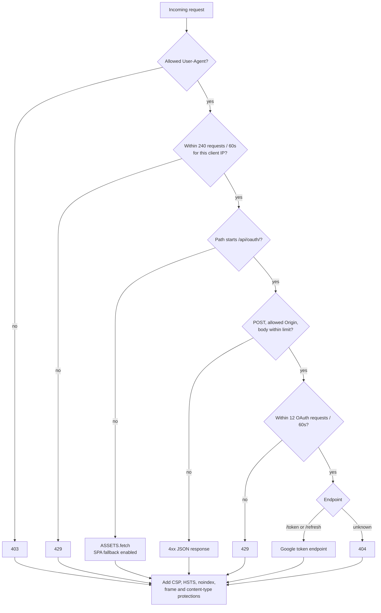
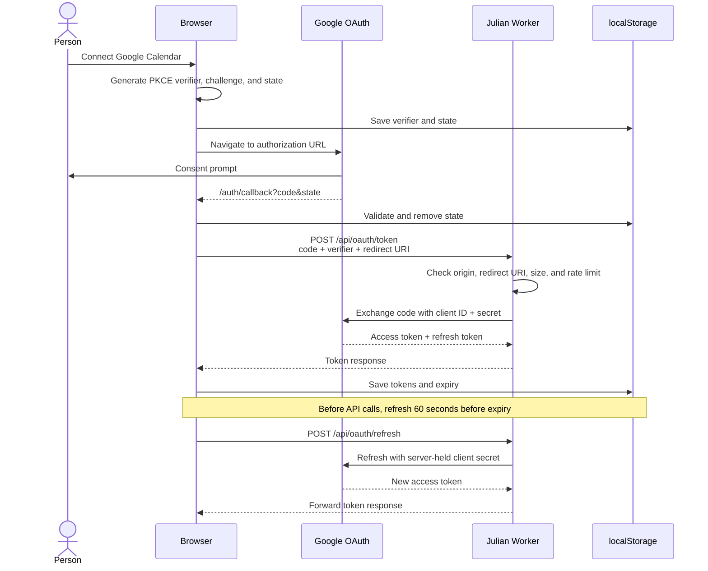
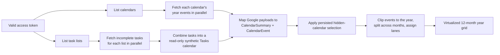
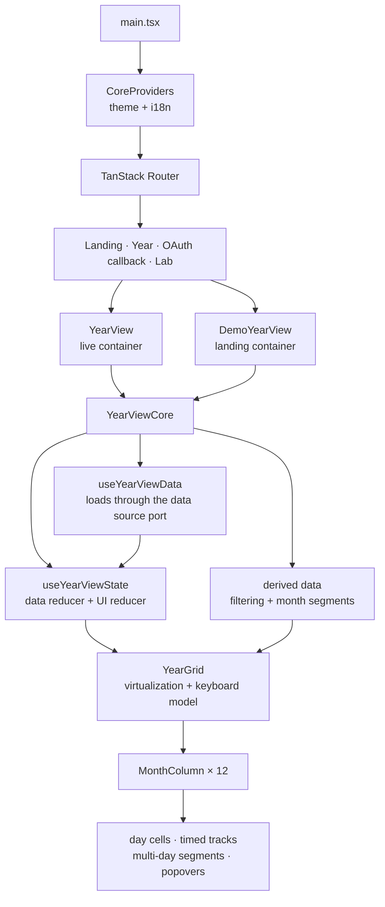
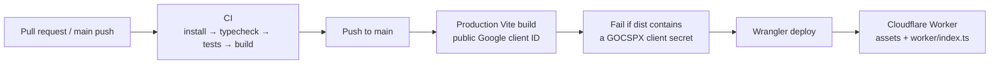

# Architecture

Julian is a browser-rendered React application served by a Cloudflare Worker.
The browser talks directly to Google Calendar and Google Tasks after
authentication; the Worker is deliberately small and exists to protect the
static site and keep the confidential OAuth client secret out of the bundle.

## System context

There is no application database, server session, queue, KV namespace, or
durable object. Calendar data remains in Google; the browser keeps OAuth tokens
and UI preferences in local storage.

## Edge request pipeline

`assets.run_worker_first` ensures static files cannot bypass the Worker.

Every exit path receives the same security headers. See
[`security.md`](security.md) for the exact allowlists, rate limits, headers,
verification commands, and accepted token-storage risk.

## OAuth authorization and refresh

The Worker never stores a token. It adds the confidential client secret to a
same-origin exchange and forwards Google's response. `state` protects the
callback, and PKCE binds the authorization code to the browser that started the
flow.

## Calendar data flow

Calendar/event fetch failures are isolated per calendar, and task-list failures
are isolated per list. A partial year can therefore render even when one Google
resource fails. Creating, renaming, and deleting events call the Calendar API
directly, then update the reducer-backed view state. Google Tasks are read-only
in Julian.

## Frontend composition

The domain layer in `src/domain/` owns date parsing, event normalization,
composite event keys, year clipping, month segmentation, and greedy lane
assignment. Components consume those results rather than duplicating calendar
math.

### Year-view ports

`YearViewCore` holds the entire year view but no opinion about where its data
and its focus live. Three ports in
`src/components/year-view/year-view-ports.ts` supply that, so the same component
serves both the signed-in app and the landing page:

| Port                  | Live container (`year-view.tsx`)            | Demo container (`landing/demo-year-view.tsx`) |
| --------------------- | ------------------------------------------- | --------------------------------------------- |
| `YearViewRouterPort`  | TanStack Router search params               | local `useState`                              |
| `YearViewDataSource`  | Google Calendar + stored calendar selection | generated fixture year, in memory             |
| `YearViewEventApi`    | Google create/update/delete                 | in-memory store                               |
| `YearViewPreferences` | `localStorage` sidebar preference           | in-memory ref                                 |

The landing page therefore demonstrates the product by running it, not by
reimplementing it — a lookalike would drift from the real view on every change.

### Landing demo

`src/components/landing/` scripts a tour over that demo container. The year
grid registers its keydown handler on `window` and does not check `isTrusted`,
so `demo-input.ts` dispatches real `KeyboardEvent`s and the application's own
logic — including its guards — handles them. `use-demo-player.ts` stops the tour
on the first trusted keystroke, click, or when the demo scrolls out of view, and
does not autoplay for coarse pointers, narrow viewports, or
`prefers-reduced-motion`. The tour writes nothing that outlives the visit:
events, calendar selection, and sidebar state are in-memory (supplied through
the ports rather than the app's storage helpers), and the theme beat completes a
full cycle back to the mode the visitor arrived with.

### Route behavior

| Route            | Purpose                                                                                 |
| ---------------- | --------------------------------------------------------------------------------------- |
| `/`              | Public landing page; redirects to the year view when a Google session is already stored |
| `/year/$year`    | Lazy-loaded year view; the current year redirects to a URL containing today's month/day |
| `/auth/callback` | Validates OAuth state and exchanges the single-use code                                 |
| `/lab`           | Component/design experimentation                                                        |

The `/` guard reads `localStorage` synchronously via `src/lib/session.ts` rather
than awaiting `isAuthenticated()`, so a returning visitor never sees the pitch
flash before the redirect. The year view still performs the full authenticated
check once it mounts.

Search parameters hold the focused month/day so the selected date is linkable.
The Worker serves `index.html` for unknown asset paths, allowing client-side
routes to load directly.

## Browser storage

| Key / family                       | Contents                  | Lifetime                                          |
| ---------------------------------- | ------------------------- | ------------------------------------------------- |
| `google:access_token`              | Google access token       | Until logout, refresh failure, or manual clearing |
| `google:refresh_token`             | Google refresh token      | Until logout, refresh failure, or revocation      |
| `google:expires_at`                | Access-token expiry epoch | Updated after token exchange/refresh              |
| `google:pkce_verifier`             | PKCE verifier             | Removed after successful callback                 |
| `google:oauth_state`               | Anti-forgery state        | Removed when callback is handled                  |
| calendar-selection key             | Hidden calendar IDs       | Persistent UI preference                          |
| `julian.yearView.sidebarCollapsed` | Sidebar state             | Persistent UI preference                          |
| theme preference                   | Theme selection           | Managed by the theme provider                     |

No event title, description, or calendar contents are deliberately persisted by
Julian. The OAuth token rows are security-sensitive; the strict script CSP is a
load-bearing control.

## Build and deployment

The build produces split chunks for React, TanStack Router, Radix, icons, and
other vendors. CI runs type checks, tests, and a build. The deployment workflow
builds again with the public OAuth client ID, scans the output for a Google
client-secret pattern, and only then deploys.

### Configuration by phase

| Value                   | Local development                      | GitHub Actions                  | Worker runtime                       |
| ----------------------- | -------------------------------------- | ------------------------------- | ------------------------------------ |
| `VITE_GOOGLE_CLIENT_ID` | `.env` from `.env.example`             | Public value in deploy workflow | Embedded in static JS                |
| `GOOGLE_CLIENT_ID`      | Wrangler variable                      | `wrangler.jsonc`                | Worker binding                       |
| `GOOGLE_CLIENT_SECRET`  | Optional local Wrangler secret         | Never supplied to build         | Encrypted Worker secret              |
| `CLOUDFLARE_API_TOKEN`  | Operator environment for manual deploy | Repository secret               | Consumed by Wrangler, not the Worker |

The application has no third-party telemetry SDK. Operational evidence comes
from GitHub Actions, Cloudflare Worker behavior, browser console/network
inspection, and the production smoke tests in [`security.md`](security.md).

## Failure behavior

| Failure                   | User-visible result                             | Recovery                                 |
| ------------------------- | ----------------------------------------------- | ---------------------------------------- |
| No stored Google token    | Empty calendar view with a connect action       | Start OAuth                              |
| Expired access token      | Automatic refresh through Worker                | Reconnect if refresh fails               |
| One calendar fetch fails  | Other calendars and tasks still render          | Retry/reload calendars                   |
| One task list fails       | Other task lists still render                   | Retry/reload                             |
| OAuth proxy misconfigured | Callback or refresh reports failure             | Restore Worker secret/config             |
| Mutation fails            | Existing state remains and an error is surfaced | Retry after checking access role/network |
| Render failure            | Route/year error boundary                       | Retry or reload                          |

## Where to change things

| Change                                           | Primary files                                                                 |
| ------------------------------------------------ | ----------------------------------------------------------------------------- |
| OAuth scopes, token lifecycle, Google mapping    | `src/lib/google-calendar.ts`                                                  |
| Edge routing, OAuth allowlist, security headers  | `worker/index.ts`, `wrangler.jsonc`, `public/_headers`                        |
| Route structure and URL contract                 | `src/router.tsx`, `src/lib/year-view-url.ts`                                  |
| Calendar math and event segmentation             | `src/domain/`                                                                 |
| Year-view state and orchestration                | `src/components/use-year-view-state.ts`, `src/components/year-view-core.tsx`  |
| Where the year view gets data, focus, and writes | `src/components/year-view/year-view-ports.ts`, `src/components/year-view.tsx` |
| Landing page and its scripted demo               | `src/routes/landing-page.tsx`, `src/components/landing/`                      |
| Month rendering and virtualization               | `src/components/year-view/`                                                   |
| Build chunking and deployment                    | `vite.config.ts`, `.github/workflows/deploy.yml`                              |

## Related documentation

- [`development.md`](development.md) — local commands and focused workflows.
- [`security.md`](security.md) — threat model, concrete edge controls, and smoke
  tests.
- [`follow-ups.md`](follow-ups.md) — open operational and security items.
